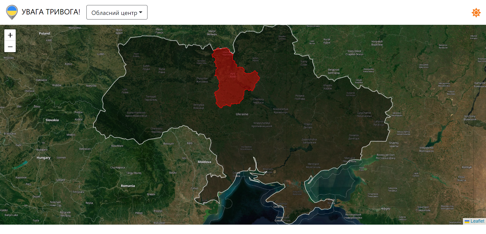
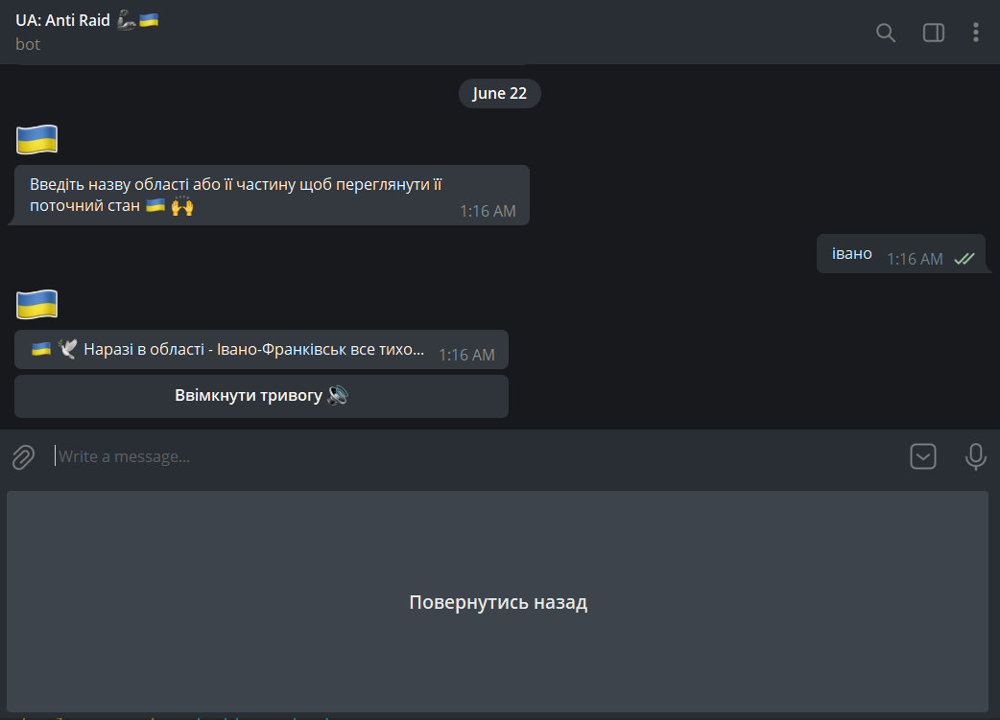

# Air Attack Alarm System

---
**Description:** Application is 
used keep ukrainian folks updated 
about possible air raids.

_Telegram Bot: @AirRaidBot_

## Functional Components
### Map

Map allows to see current state of alarm in Ukraine.
Districts highlighted with red are those that
have air raid alarm turned on.

### Bot
Telegram bot integrated with application, 
that is used to subscribe for notification 
about alarm and to turn it on or off.

## Installation
In order to install application you will need to
run `docker-compose.yml` file using docker-compose

`.env` file should be created in root directory of project,
and also all references from `docker-compose.yml`
should be resolved in `.env` file
